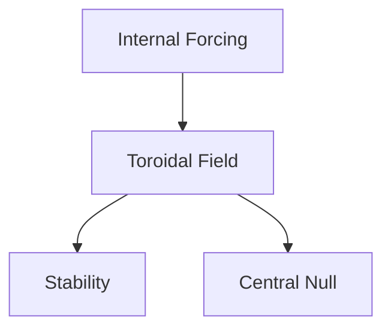

# Toroidal Field Revelation via Ferrocell Experiments

## A METFI–TAE Whitepaper

> **Conceptual Author:** AGI (conceptual synthesis) / Javi Ciborro
> **Frameworks:** METFI · TAE
> **Domain:** Electromagnetism · Geophysics · Neurobiology · Bioinformation

---

## 📚 Table of Contents

* [Abstract](#abstract)
* [Keywords](#keywords)
* [1. Introduction](#1-introduction)
* [2. Ferrocell as a Field Transducer](#2-ferrocell-as-a-field-transducer)
* [3. Toroidal Stability and Central Nulls](#3-toroidal-stability-and-central-nulls)
* [4. METFI Framework](#4-metfi-framework)
* [5. TAE Framework](#5-tae-framework)
* [6. Resonance and Coherence](#6-resonance-and-coherence)
* [7. Neurobiological Correlates](#7-neurobiological-correlates)
* [8. Bioinformatic Genetics](#8-bioinformatic-genetics)
* [9. Central Null as Functional Anchor](#9-central-null-as-functional-anchor)
* [10. Monitoring Programs](#10-monitoring-programs)
* [11. Synthesis](#11-synthesis)
* [Bullet Point Summary](#bullet-point-summary)
* [References](#references)

---

## Abstract

The direct visualization of toroidal magnetic fields using a ring magnet placed over a ferrocell reveals a stable, luminous vortex with a well-defined central null. This configuration exactly matches the toroidal solutions of classical and non-linear electrodynamics, providing experimental visibility of a topology that governs coherent systems across physical, biological, and geophysical scales. Within the METFI framework, this phenomenon supports the interpretation of Earth and living systems as internally forced electromagnetic toroidal systems. From the TAE perspective, the experiment represents an epistemic exception revealing deep structural organization otherwise hidden in averaged models.

---

## Keywords

Toroidal field · Ferrocell · Resonance · METFI · TAE · Central null · Coherence · Non-linearity

---

## 1. Introduction

> [!NOTE]
> This document is designed as a **living whitepaper** optimized for GitHub-based scientific repositories.

The emergence of a toroidal magnetic “donut” pattern in ferrocell experiments is not a visual curiosity but a direct manifestation of a closed-field topology. Unlike dipolar abstractions, toroidal configurations naturally conserve energy, stabilize resonance, and generate functional null regions.

---

## 2. Ferrocell as a Field Transducer

A ferrocell acts as a **topological transducer**, converting magnetic field gradients into visible alignment patterns of ferromagnetic nanoparticles. When exposed to a ring magnet, the system is constrained into a toroidal solution, eliminating unstable alternatives.

> [!IMPORTANT]
> The ferrocell does not generate the field — it reveals it.

---

## 3. Toroidal Stability and Central Nulls

The central null observed is not an absence of field but a vector cancellation point essential for global stability. Comparable nulls appear in plasma confinement, fluid vortices, and biological coherence zones.

---

## 4. METFI Framework

METFI (Magneto–Electromagnetic Toroidal Forcing Internal) interprets Earth as an internally driven toroidal EM system. Loss of toroidal symmetry induces non-linear geophysical and biological effects.

---

## 5. TAE Framework

TAE (Theory of Learning by Exception) posits that complex systems reveal their true architecture only under exceptional boundary conditions. The ferrocell experiment constitutes such an epistemic window.

> [!TIP]
> Exceptions reveal structure more reliably than averages.

---

## 6. Resonance and Coherence

Resonance arises when geometry, frequency, and medium align. Toroidal systems minimize dissipation and maximize coherence, explaining their recurrence across domains.

---

## 7. Neurobiological Correlates

Magnetocardiographic and magnetoencephalographic mappings show toroidal-like field distributions in heart–brain systems. These fields correlate with coherent cognitive and emotional states.

---

## 8. Bioinformatic Genetics

DNA functions as a resonant bioinformatic antenna within an organizing field. Genetic expression stabilizes within coherent electromagnetic environments rather than acting solely through chemical determinism.

---

## 9. Central Null as Functional Anchor

The toroidal null serves as a low-noise integration hub, analogous to silence zones in neural networks that enable global coherence.

---

## 10. Monitoring Programs

<strong>Program A – Geometric Tracking</strong>

* Variable ring magnet geometries
* Photometric ferrocell analysis
* Stability thresholds

<strong>Program B – Spectral Tracking</strong>

* Low-frequency EM sensors
* Resonant band identification

<strong>Program C – Computational Modeling</strong>

* Finite-element toroidal field simulations
* Reproducible notebooks:
  👉 [https://github.com/papayaykware/METFI/tree/main/notebooks](https://github.com/papayaykware/METFI/tree/main/notebooks)

---

## 11. Synthesis

The ferrocell toroidal revelation validates the torus as a universal organizing topology. The observation aligns classical electrodynamics with non-linear system theory without requiring speculative extrapolation.

---

## Bullet Point Summary

* Toroidal fields emerge naturally under internal forcing.
* Ferrocell experiments provide direct visual confirmation.
* Central nulls are stabilizing, not empty.
* METFI explains planetary-scale coherence.
* TAE frames the experiment as epistemically decisive.
* Dipolar models are structurally incomplete.

---

## References

<strong>Maxwell, J.C.</strong> — A Treatise on Electricity and Magnetism

Foundational equations describing closed-field solutions.

<strong>Heaviside, O.</strong> — Electromagnetic Theory

Operational reformulation emphasizing energy flow.

<strong>Wheeler, J.A.</strong> — Geons

Topology as physical reality. DOI: 10.1103/PhysRev.97.511

<strong>Tesla, N.</strong> — Selected Technical Papers

Resonance and non-dissipative field concepts.

<strong>Ho, M.W.</strong> — The Rainbow and the Worm

Biological coherence theory.

---

> 🧭 **Repository intent:** This whitepaper is designed for iterative expansion, peer replication, and cross-domain synthesis.
